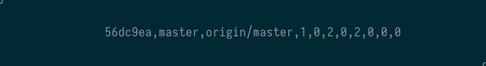

porcelain
============

Parses `git status --porcelain` and outputs nicely formatted strings.

**Formatted output with `porcelain -fmt`**


**Basic output with `porcelain -basic`**



```
   commit,branch,tracked_branch,ahead,behind,untracked,added,modified,deleted,renamed,copied
```
